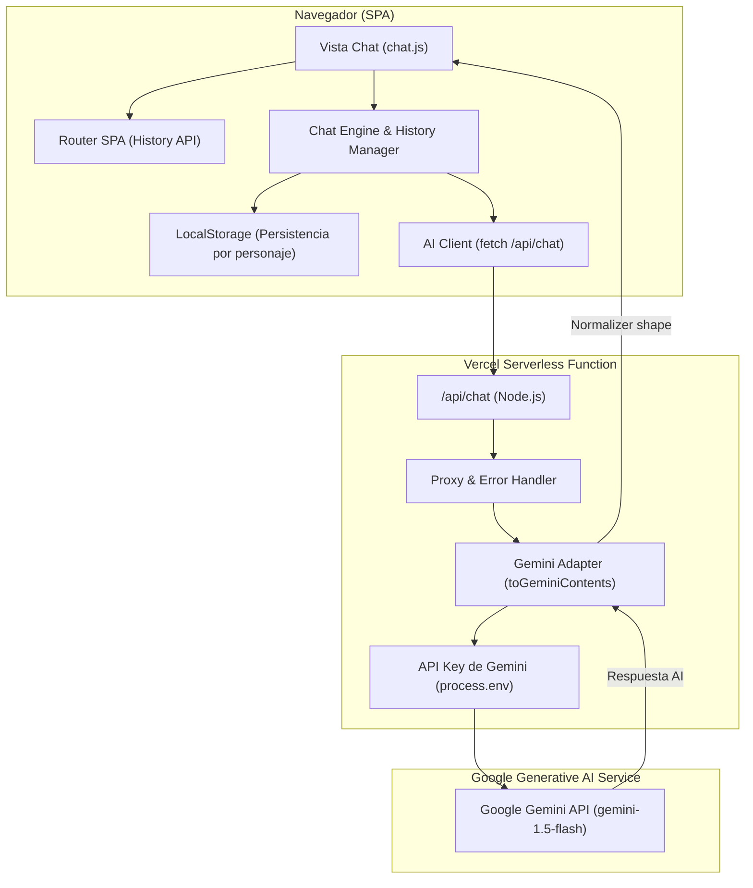

# 🤖 PIM3 — Chat AI Serverless con Google Gemini

[](https://vitest.dev)
[](https://vercel.com)
[](LICENSE)

Una Single Page Application (SPA) full-stack y altamente escalable construida con JavaScript moderno (ES Modules), CSS3 dinámico y funciones Serverless de Vercel para interactuar con la API de Google Gemini de forma totalmente segura.

> 🌐 **URL Pública Desplegada en Vercel:** [https://proyecto-m3-stiven-zabala.vercel.app](https://proyecto-m3-stiven-zabala.vercel.app)  
> 📦 **Repositorio GitHub:** [https://github.com/Stivenzbl/ProyectoM3-StivenZabala](https://github.com/Stivenzbl/ProyectoM3-StivenZabala)

---

## 🎨 Características Destacadas & 😎 Extra Credit

- **⚡ Arquitectura Serverless Segura**: La API Key de Google Gemini (`GEMINI_API_KEY`) nunca se expone en el cliente; las peticiones se realizan a través del backend Serverless `/api/chat`.
- **🌙 Modo Oscuro / Claro (Dark & Light Theme Toggle)**: Conmutación dinámica de tema global con persistencia en `localStorage`, variables CSS y adaptación automática a las preferencias del sistema operativo.
- **💾 Persistencia de Historial con `LocalStorage`**: Almacena y restaura las conversaciones de forma independiente para cada personaje, con indicador de estado (`💾 Historial restaurado` / `💾 Memoria activa`) y botón de reseteo (`🗑️ Reset`).
- **🎭 Galería & Selector Rápido de 4 Personajes**:
  1. 🧪 **Dr. Science**: Explicaciones didácticas y analogías simples.
  2. 👨‍🍳 **Chef Claude**: Pasión culinaria, recetas y metáforas gastronómicas.
  3. 🕵️ **Detective**: Análisis lógico, deductivo y basado estrictamente en evidencia.
  4. 🚀 **Astro Explorer**: Divulgación astronómica, estrellas y agujeros negros.
  - Incluye un selector desplegable directamente en la barra superior del chat para cambiar de personaje sin volver a la pantalla de inicio.
- **⌨️ Composer Inteligente**:
  - Envió directo con la tecla `Enter`.
  - Copiado rápido de respuestas de la IA al portapapeles (`📋` $\rightarrow$ `✅`).
  - Timestamps dinámicos por mensaje (`HH:MM`).
  - Indicador animado de "Escribiendo..." (`...`).
  - Reintento automático inteligente en caso de límite de tasa (`429 Rate Limit`).
- **🥚 Huevos de Pascua (Easter Eggs)**: Respuestas especiales interactivas al enviar palabras clave como `ping`, `pong`, `42` o `gracias`.
- **🧪 Cobertura de Tests con Vitest**: 17 pruebas unitarias automatizadas que garantizan la robustez de las funciones de storage, adaptadores de Gemini, recortado de historial, payloads y normalizador de respuestas.

---

## 📐 Arquitectura del Sistema



---

## 🎭 Personajes de IA Disponibles

| Personaje | Icono | Descripción / Estilo | Temperatura |
| :--- | :---: | :--- | :---: |
| **Dr. Science** | 🧪 | Explicaciones didácticas con analogías sencillas y experimentos mentales. | `0.7` |
| **Chef Claude** | 👨‍🍳 | Metáforas culinarias, sabor gastronómico y recetas creativas. | `0.8` |
| **Detective** | 🕵️ | Razonamiento deductivo, metódico e imparcial basado en evidencias. | `0.4` |
| **Astro Explorer** | 🚀 | Divulgación espacial, fascinación por el cosmos y agujeros negros. | `0.75` |

---

## 🛠️ Tecnologías Utilizadas

- **Frontend**: HTML5 Semántico, CSS3 Dinámico (Custom Properties, Flexbox, Grid, Glassmorphic effects), JavaScript ES6+ Módulos.
- **Backend / Middleware**: Vercel Serverless Functions (`api/chat.js`), SDK oficial `@google/generative-ai`.
- **Testing**: Vitest 1.6.0.
- **Herramientas de Desarrollo**: Vite / Vercel CLI.

---

## 📦 Guía de Instalación y Ejecución Local

### 1. Clonar el repositorio
```bash
git clone https://github.com/Stivenzbl/ProyectoM3-StivenZabala.git
cd "trabajo final"
```

### 2. Instalar dependencias
```bash
npm install
```

### 3. Configurar variables de entorno
Crea un archivo `.env` en la raíz del proyecto (basándote en `.env.example`):
```env
GEMINI_API_KEY=tu_api_key_de_google_gemini_aqui
```
> Puedes obtener una API Key gratuita en [Google AI Studio](https://aistudio.google.com/).

### 4. Iniciar el servidor local
Para probar la aplicación junto con las funciones serverless de Vercel:
```bash
npx vercel dev
```
O para servir únicamente los archivos estáticos:
```bash
npm run dev
```

---

## 🧪 Ejecución de Pruebas Unitarias

El proyecto incluye 17 tests unitarios ejecutados con **Vitest**:

```bash
# Ejecutar suite de pruebas una sola vez
npm run test:run

# Modo observador (watch mode)
npm test
```

### Resumen de Suites de Test:
- `tests/storage.test.js`: Valida guardado, recuperación y limpieza en `localStorage`.
- `tests/payload.test.js`: Valida la construcción correcta del payload y rechazo de roles prohibidos.
- `tests/normalizer.test.js`: Valida la extracción de texto y detección de respuestas truncadas.
- `tests/history.test.js`: Valida la inmutabilidad y recorte de historial (`getTrimmedHistory`).
- `tests/gemini.test.js`: Valida el mapeo de roles (`assistant` $\rightarrow$ `model`).
- `tests/aiClient.test.js`: Valida la gestión de errores HTTP y respuestas de la API.

---

## 🚀 Despliegue en Vercel

1. Iniciar sesión en Vercel CLI:
   ```bash
   npx vercel login
   ```
2. Desplegar a producción:
   ```bash
   npx vercel --prod
   ```
3. Configurar la variable de entorno en el panel de Vercel:
   - **Nombre:** `GEMINI_API_KEY`
   - **Valor:** Tu clave de API de Google AI Studio.

---

## 🤖 Registro del Uso de Inteligencia Artificial (AI Usage Log)

Durante el desarrollo de este proyecto integrador se utilizaron herramientas de IA como asistente de programación de acuerdo con los lineamientos de la consigna:

1. **Definición de System Prompts**: Se iteraron prompts para cada personaje en Google AI Studio para asegurar respuestas concisas (máximo 3 líneas) y con personalidad consistente.
2. **Modularización & Clean Architecture**: Se utilizó IA para diseñar una separación estricta entre la UI (`src/ui/render.js`), el motor de chat (`src/engine/`) y las Serverless Functions (`api/chat.js`).
3. **Refactorización de CSS**: Asistencia en la creación del tema dinámico claro/oscuro utilizando CSS Custom Properties (`[data-theme="light"]`) sin romper el diseño futurista de neón.

---

## 📄 Licencia

Este proyecto está bajo la Licencia MIT — ver el archivo [LICENSE](LICENSE) para más detalles.