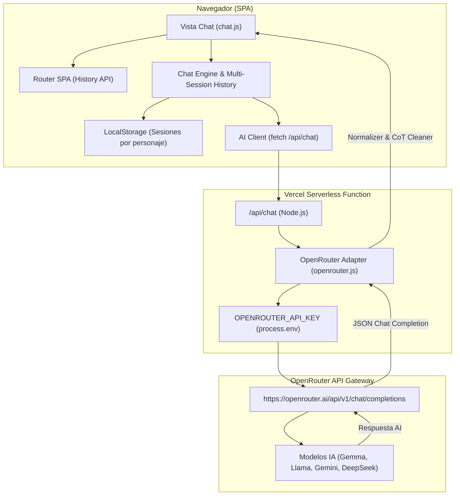

# 🤖 PIM3 — Chat AI Serverless con OpenRouter API

[](https://vitest.dev)
[](https://openrouter.ai)
[](https://vercel.com)
[](LICENSE)

Una Single Page Application (SPA) full-stack y altamente escalable construida con JavaScript moderno (ES Modules), CSS3 dinámico y funciones Serverless de Vercel integradas con **OpenRouter API Gateway** (estándar OpenAI Chat Completions) para acceder a múltiples modelos de IA de forma segura, estable y sin bloqueos de cuota.

> 🌐 **URL Pública Desplegada en Vercel:** [https://proyecto-m3-stiven-zabala.vercel.app](https://proyecto-m3-stiven-zabala.vercel.app)  
> 📦 **Repositorio GitHub:** [https://github.com/Stivenzbl/ProyectoM3-StivenZabala](https://github.com/Stivenzbl/ProyectoM3-StivenZabala)

---

## 📸 Capturas de Pantalla (Preview de la Aplicación)

### 1. Vista de Inicio (Home — Galería de Personajes)
- Selección interactiva entre múltiples personajes con tarjetas neón futuristas en modo oscuro y adaptables en modo claro.

```
+-----------------------------------------------------------------------+
| 🤖 Chat AI                  Inicio   Chat   Acerca       [ ☀️ / 🌙 ] |
+-----------------------------------------------------------------------+
|                       PROYECTO INTEGRADOR · M3                        |
|                         🤖 PIM3 CHAT AI                               |
|        Elige a tu personaje favorito e inicia una conversación         |
|                                                                       |
|  [ 🧪 Dr. Science ]   [ 👨‍🍳 Chef Claude ]   [ 🕵️ Detective ]   [ 🚀 Astro ]  |
+-----------------------------------------------------------------------+
```

### 2. Vista de Chat Conversacional con Historial Multisesión
- Panel lateral (Sidebar Drawer) estilo ChatGPT / Claude con guardado automático, títulos autogenerados, creación de nuevos chats y selector directo de personaje.

```
+-----------------------------------------------------------------------+
| 📜 HISTORIAL    | ← Inicio | 🧪 Dr. Science | [🧪 Dr. Science v] [🗑️ Reset]|
+-----------------+-----------------------------------------------------+
| ➕ Nuevo Chat   | VOS                                           14:35 |
|                 |   ¿Por qué el cielo es azul?                        |
| 📜 CONVERSACIONES|                                                     |
| • Dispersión... | DR. SCIENCE                                   14:35 |
| • Experimento.. |   Por la dispersión de Rayleigh: las moléculas de   |
| • Fotos Júpiter |   aire dispersan la luz azul en todas direcciones.  |
+-----------------+-----------------------------------------------------+
|                 | [ Escribí tu mensaje... (Enter para enviar)   ] (↑)   |
+-----------------------------------------------------------------------+
```

---

## 🎨 Características Destacadas & 😎 Extra Credit

- **🌐 Integración con OpenRouter API Gateway**:
  - Utiliza el estándar de la industria **OpenAI Chat Completions** (`/v1/chat/completions`) mediante la pasarela unificada de OpenRouter.
  - Modelo por defecto: `openrouter/free`, el enrutador oficial que selecciona dinámicamente el modelo gratuito más saludable disponible.
  - Elimina bloqueos estrictos de cuota RPM y la necesidad de usar SDKs propietarios rígidos.
- **📜 Gestor de Historial Multisesión (Estilo ChatGPT / Claude)**:
  - Guardado automático e independiente de múltiples conversaciones por personaje en `localStorage`.
  - Generación dinámica de títulos de sesión a partir del primer mensaje del usuario.
  - Botón **`➕ Nuevo Chat`** para iniciar conversaciones limpias sin perder los chats anteriores.
  - Panel lateral interactivo (Sidebar Drawer en móviles) para alternar, consultar o eliminar sesiones guardadas.
- **🧹 Filtro Anti-Fuga de Razonamiento (CoT & Safety Scrubber)**:
  - Limpieza automática en 2 capas que remueve bloques `<think>...</think>`, análisis internos en inglés (`I need to stick to the rules...`) y metadatos de seguridad (`User Safety: safe`).
  - Garantiza que las respuestas entregadas en la UI sean **100% en español fluido y dentro del personaje**.
- **🌙 Modo Oscuro / Claro (Dark & Light Theme Toggle)**:
  - Conmutación dinámica de tema global con persistencia en `localStorage`, variables CSS y adaptación automática a las preferencias del sistema operativo.
- **♿ Accesibilidad Avanzada & Efectos Neón**:
  - Enlace de accesibilidad *"Saltar al contenido principal"* con animación de resplandor neón pulsante (`@keyframes skipPulse`) al navegar con teclado (Tab).
- **🎭 Galería de 4 Personajes**:
  1. 🧪 **Dr. Science**: Explicaciones didácticas y analogías sencillas.
  2. 👨‍🍳 **Chef Claude**: Pasión culinaria, recetas y metáforas gastronómicas.
  3. 🕵️ **Detective**: Análisis lógico, deductivo y basado estrictamente en evidencia.
  4. 🚀 **Astro Explorer**: Divulgación astronómica, estrellas y agujeros negros.
- **🧪 Cobertura Total con Vitest**: 22 pruebas unitarias automatizadas que garantizan la solidez de las funciones de storage, adaptadores de OpenRouter, recortado de historial, payloads y normalizador de respuestas.

---

## 📐 Arquitectura del Sistema



---

## 🎭 Personajes de IA Disponibles

| Personaje | Icono | Descripción / Estilo | Temperatura |
| :--- | :---: | :--- | :---: |
| **Dr. Science** | 🧪 | Explicaciones didácticas con analogías sencillas y experimentos mentales. | `0.7` |
| **Chef Claude** | 👨‍🍳 | Metáforas culinarias, sabor gastronómico y recetas creativas. | `0.8` |
| **Detective** | 🕵️ | Razonamiento deductivo, metódico e imparcial basado en evidencias. | `0.4` |
| **Astro Explorer** | 🚀 | Divulgación espacial, fascinación por el cosmos y agujeros negros. | `0.75` |

---

## 🛠️ Tecnologías Utilizadas

- **Frontend**: HTML5 Semántico, CSS3 Dinámico (Custom Properties, Flexbox, Grid, Glassmorphic effects), JavaScript ES6+ Módulos.
- **Backend / Middleware**: Vercel Serverless Functions (`api/chat.js`), OpenRouter API Gateway (`/v1/chat/completions`).
- **Testing**: Vitest 1.6.0.
- **Herramientas de Desarrollo**: Vite / Vercel CLI.

---

## 📦 Guía de Instalación y Ejecución Local

### 1. Clonar el repositorio
```bash
git clone https://github.com/Stivenzbl/ProyectoM3-StivenZabala.git
cd "trabajo final"
```

### 2. Instalar dependencias
```bash
npm install
```

### 3. Configurar variables de entorno
Crea un archivo `.env` en la raíz del proyecto (basándote en `.env.example`):
```env
OPENROUTER_API_KEY=sk-or-v1-tu_clave_de_openrouter_aqui
```
> Puedes obtener una clave de API gratuita en [OpenRouter.ai Keys](https://openrouter.ai/keys).

### 4. Iniciar el servidor local
Para probar la aplicación junto con las funciones serverless de Vercel:
```bash
npx vercel dev
```
O para servir únicamente los archivos estáticos:
```bash
npm run dev
```

---

## 🧪 Ejecución de Pruebas Unitarias

El proyecto incluye **22 tests unitarios** ejecutados con **Vitest**:

```bash
# Ejecutar suite de pruebas una sola vez
npm run test:run

# Modo observador (watch mode)
npm test
```

### Resumen de Suites de Test:
- `tests/openrouter.test.js`: Valida el adaptador de OpenRouter, formato OpenAI y detección de claves.
- `tests/storage.test.js`: Valida la gestión multisesión, títulos autogenerados, guardado y eliminación en `localStorage`.
- `tests/payload.test.js`: Valida la construcción del payload con directivas estrictas de idioma.
- `tests/normalizer.test.js`: Valida la eliminación de pensamientos en inglés (`CoT scrubber`) y etiquetas de seguridad.
- `tests/history.test.js`: Valida la inmutabilidad y recorte del historial (`getTrimmedHistory`).
- `tests/gemini.test.js`: Valida compatibilidad y formato de contenido.
- `tests/aiClient.test.js`: Valida la gestión de errores HTTP y respuestas de la API.

---

## 🚀 Despliegue en Vercel

1. Iniciar sesión en Vercel CLI:
   ```bash
   npx vercel login
   ```
2. Desplegar a producción:
   ```bash
   npx vercel --prod
   ```
3. Configurar la variable de entorno en el panel de Vercel:
   - **Nombre:** `OPENROUTER_API_KEY`
   - **Valor:** Tu clave de API de OpenRouter (`sk-or-v1-...`).

---

## 🤖 Registro del Uso de Inteligencia Artificial (AI Usage Log)

Durante el desarrollo de este proyecto integrador se utilizaron herramientas de IA como asistente de programación de acuerdo con los lineamientos de la consigna:

1. **Migración a OpenRouter API Gateway**: Se diseñó una arquitectura desacoplada basada en el estándar universal de OpenAI `/v1/chat/completions`.
2. **Definición de System Prompts**: Se estructuraron directivas inviolables para garantizar respuestas concisas (máximo 3 líneas) y 100% en idioma español.
3. **Gestor Multisesión de Historial**: Implementación del sidebar lateral e inmutabilidad de datos en `localStorage`.
4. **Refactorización de CSS**: Creación del sistema de temas claro/oscuro y animaciones neón de accesibilidad.

---

## 📄 Licencia

Este proyecto está bajo la Licencia MIT — ver el archivo [LICENSE](LICENSE) para más detalles.